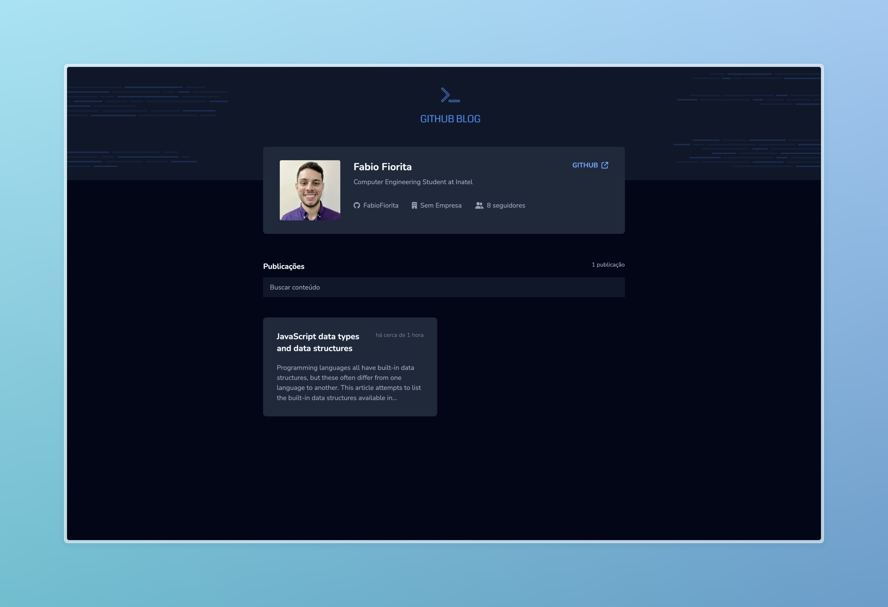

# GitHub Blog Challenge - Desafio Ignite



Este projeto é um desafio do curso Ignite da Rocketseat. O objetivo é criar uma aplicação completa de um blog pessoal consumindo a API do GitHub para exibir posts como issues de um repositório, utilizando React, TypeScript e as melhores práticas de desenvolvimento.

## Sobre o Projeto

A aplicação GitHub Blog permite que os usuários:

- React com Vite e TypeScript
- Axios para realizar requisições HTTP
- React Query para gerenciamento dos estados
- React Router DOM para a criação de rotas dinâmicas
- react-markdown para converter conteúdo Markdown em HTML

## Tecnologias Utilizadas

Para o desenvolvimento deste projeto, foram utilizadas as seguintes ferramentas e bibliotecas:

- React
- TypeScript
- Vite
- Tailwind
- React Router
- Context API
- Axios
- react-markdown

## Como Executar o Projeto

1. Clone o repositório:
```bash
git clone https://github.com/FabioFiorita/ignite-challenge-reactjs-github-blog.git
```

2. Acesse a pasta do projeto:
```bash
cd ignite-challenge-reactjs-github-blog
```

3. Instale as dependências:
```bash
npm install
```

4. Execute o projeto:
```bash
npm run dev
```

5. Agora, abra o navegador e navegue até ```http://localhost:3000/``` para ver a aplicação em execução.